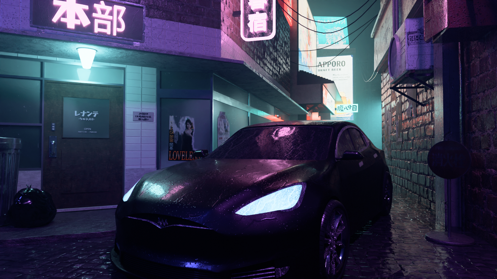

# Neon Street
3D Modeling Project in Blender for the Computer Graphics course, University of Milano-Bicocca, Academic Year 2023–2024.

The project involved modeling and assembling the entire scene shown in the renders below, including the car, buildings, and the shaders used.

## Render

